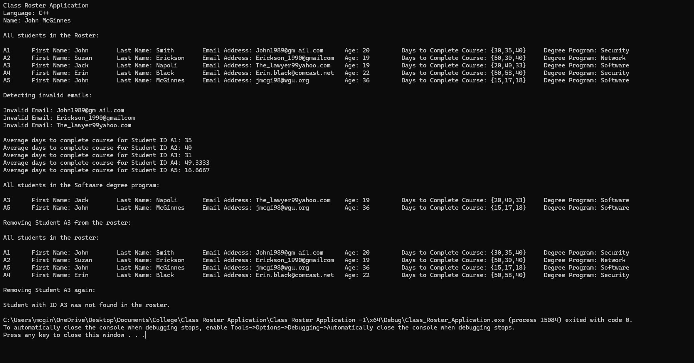

# Class Roster Application

## Overview

This program is designed to manage a class roster by storing, modifying, and displaying student information. It demonstrates basic object-oriented principles in C++, such as classes, objects, and dynamic memory management. The program allows the user to:

1. View a list of students and their details.
2. Detect and print invalid email addresses.
3. Calculate and display average course completion times for students.
4. Filter students by their degree program.
5. Remove a student from the roster.
6. Handle dynamic memory management with a custom destructor.

## Features

- **Roster Management**: Create and manage a class roster by adding students and their details.
- **Email Validation**: Identify invalid email addresses based on predefined criteria.
- **Average Days in Course**: Calculate and display the average days spent on each course for each student.
- **Degree Program Filtering**: Filter and display students by their degree program (e.g., Software, Network, Security).
- **Student Removal**: Remove a student from the roster by their unique student ID.

## File Structure

The project includes the following files:

- **main.cpp**: Contains the main program logic and invokes the methods from the `Roster` class.
- **roster.cpp**: Implementation file for the `Roster` class, which contains the logic for managing the class roster.
- **student.cpp**: Implementation file for the `Student` class, which contains the logic for managing the student class.
- **roster.h**: Header file defining the `Roster` class and its methods.
- **student.h**: Header file defining the `Student` class and its methods.
- **degree.h**: Header file defining the `Degree` class.


## Requirements

This program requires a C++ compiler that supports C++11 or later (for example, GCC or Clang). 

To compile and run the program, you will need:

- A C++ compiler
- An IDE or text editor to modify the source code (optional)

## Instructions

### 1. Compilation

To compile the program, use the following command (assuming you have the necessary C++ development environment set up):

```bash
g++ main.cpp roster.cpp -o ClassRoster
```

### 2. Running the Program

Once compiled, you can run the program with the following command:

```bash
./ClassRoster
```

### 3. Program Behavior

Upon running the program, you will see:

1. A printed introduction to the class roster.
2. The program will display the roster of students, including details like student ID, name, email, age, and days spent in courses.
3. It will also list invalid email addresses.
4. The program will calculate and show the average number of days to complete each course for each student.
5. It will filter and print all students in the "Software" degree program.
6. It will attempt to remove a student with a specific ID (e.g., A3) and show the updated roster.
7. If you attempt to remove the same student again, the program will notify you that the student is not found.

### Example Output:

```
Class Roster Application
Language: C++
Name: John McGinnes

All students in the Roster:
...
Detecting invalid emails:
...

Average days to complete course for Student ID A1: ...
Average days to complete course for Student ID A2: ...

All students in the Software degree program:
...

Removing Student A3 from the roster:
...
All students in the roster:
...

Removing Student A3 again:
...
```




## Functionality Overview

### Student Data
The program uses a pre-defined array `studentData[]` to store sample student information. It then parses this data and populates the class roster.

### Class `Roster`
The `Roster` class manages the student information. Key functions include:

- `add()`: Adds a student to the roster.
- `printAll()`: Prints the information of all students in the roster.
- `printInvalidEmails()`: Prints any invalid email addresses.
- `printAverageDaysInCourse()`: Prints the average number of days a student takes to complete their courses.
- `printByDegreeProgram()`: Filters and prints students based on their degree program (e.g., Software, Network, Security).
- `remove()`: Removes a student by their ID from the roster.

### Destructor
The program includes a destructor in the `Roster` class that releases dynamically allocated memory when the roster is no longer needed.

## Known Issues

- The program assumes that email addresses are valid if they follow a simple pattern and may not catch all edge cases.
- If a student is removed and then attempted to be removed again, the program will print a message indicating that the student was not found.

## License

This project is open source and free to use. Please feel free to modify it according to your needs.

---

This README file provides a concise but comprehensive overview of the project and its functionality, helping anyone looking to understand how to build, run, and use the program.